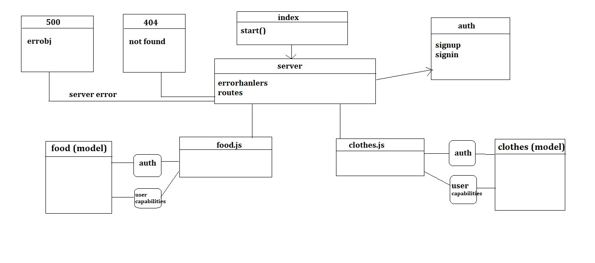

# LAB: Access Control

# Author: anwar shraideh

# links

[repo]()
[PR]()
[heroku]()

# Setup

- Clone the repository 
- Run the command npm i express dotenv morgan base-64 bcrypt cors mongoose jsonwebtoken fs jest @code-fellows/supergoose to install dependencies
- create .env file with PORT variable and MONGODB_URI and a secret key 
- Run the command npm test to test 

